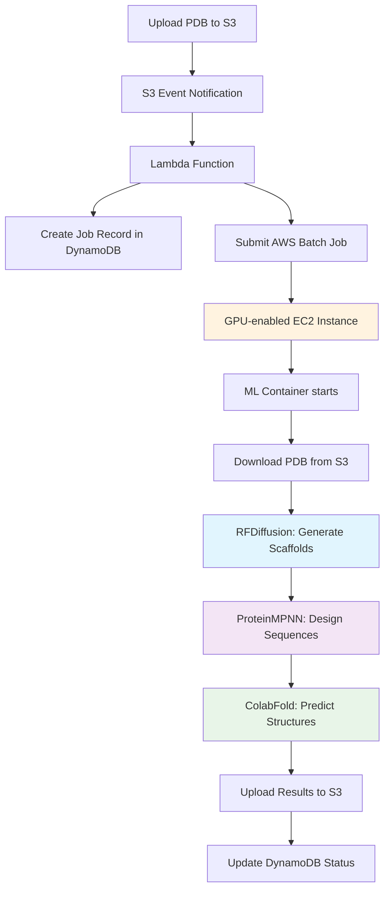

# Protein Binder Generation Pipeline

A complete AWS-based pipeline for generating protein binders using three AI models: **RFDiffusion → ProteinMPNN → ColabFold**.

## What This Does

This pipeline takes a protein target (PDB file) and automatically generates potential protein binders using AI models:

1. **RFDiffusion**: Generates protein backbone scaffolds that could bind to your target
2. **ProteinMPNN**: Designs optimal amino acid sequences for those scaffolds
3. **ColabFold**: Predicts the final 3D structures and confidence scores

## 📋 Prerequisites

### AWS Account Requirements

- **AWS Account**: You need an active AWS account with billiing enabled
- **GPU Quotas**: The pipeline uses GPU instances (p3.2xlarge, g4dn.xlarge) which may not be available by default
- **Cost Warning**: GPU instances cost ~$3-10/hour. Each job typically takes 30-60 minutes

### Step 1: Install AWS CLI

The AWS CLI is required to deploy and manage the pipeline.

#### Windows
```bash
# Download and run the AWS CLI installer
# Visit: https://awscli.amazonaws.com/AWSCLIV2.msi
# Or use chocolatey:
choco install awscli
```

#### macOS
```bash
# Using Homebrew (recommended)
brew install awscli

# Or download the installer
curl "https://awscli.amazonaws.com/AWSCLIV2.pkg" -o "AWSCLIV2.pkg"
sudo installer -pkg AWSCLIV2.pkg -target /
```

#### Linux
```bash
# Ubuntu/Debian
curl "https://awscli.amazonaws.com/awscli-exe-linux-x86_64.zip" -o "awscliv2.zip"
unzip awscliv2.zip
sudo ./aws/install

# Amazon Linux/CentOS/RHEL
yum install awscli
```

#### Verify Installation
```bash
aws --version
# Should output: aws-cli/2.x.x Python/3.x.x...
```

### Step 2: Configure AWS CLI

You need AWS credentials to deploy the pipeline. Get these from your AWS account.

#### Option A: Get Credentials from AWS Console

1. **Login to AWS Console**: Go to [console.aws.amazon.com](https://console.aws.amazon.com)
2. **Navigate to IAM**: Search for "IAM" in the top search bar
3. **Create Access Key**:
   - Click "Users" → Your username → "Security credentials" tab
   - Click "Create access key" → "Command Line Interface (CLI)"
   - **Important**: Download and save the CSV file with your credentials

#### Option B: Use AWS CloudShell (Easy Alternative)

1. Login to AWS Console
2. Click the CloudShell icon (>_) in the top toolbar
3. CloudShell comes pre-configured with credentials

#### Configure AWS CLI with Your Credentials

```bash
aws configure
```

Enter your information when prompted:
```
AWS Access Key ID [None]: YOUR_ACCESS_KEY_ID
AWS Secret Access Key [None]: YOUR_SECRET_ACCESS_KEY
Default region name [None]: us-east-1
Default output format [None]: json
```

#### Verify Configuration
```bash
# Test that AWS CLI works
aws sts get-caller-identity

# Should output your account info:
# {
#     "UserId": "...",
#     "Account": "123456789012",
#     "Arn": "arn:aws:iam::123456789012:user/yourname"
# }
```

### Step 3: Set Up IAM Permissions

Your AWS user needs specific permissions to deploy the pipeline.

#### Quick Setup (Broad Permissions)

This gives broad administrative access. Use only for testing/personal accounts.

```bash
# Attach AdministratorAccess policy to your user
aws iam attach-user-policy \
    --user-name YOUR_USERNAME \
    --policy-arn arn:aws:iam::aws:policy/AdministratorAccess
```

#### Secure Setup (Recommended for Production)

Create a custom policy with minimal required permissions:

1. **Create the policy**:
```bash
# Create policy from the included iam-policy.json file
aws iam create-policy \
    --policy-name ProteinBinderPipelinePolicy \
    --policy-document file://iam-policy.json
```

2. **Attach to your user**:
```bash
# Replace YOUR_ACCOUNT_ID with your 12-digit AWS account ID
aws iam attach-user-policy \
    --user-name YOUR_USERNAME \
    --policy-arn arn:aws:iam::YOUR_ACCOUNT_ID:policy/ProteinBinderPipelinePolicy
```

3. **Verify permissions**:
```bash
# Test that you can access required services
aws ec2 describe-availability-zones
aws s3 ls
```

### Step 4: Check GPU Service Quotas

GPU instances may not be available by default in your account.

#### Check Current Quotas
```bash
# Check p3.2xlarge quota (Tesla V100 GPUs)
aws service-quotas get-service-quota \
    --service-code ec2 \
    --quota-code L-417A185B

# Check g4dn.xlarge quota (Tesla T4 GPUs)
aws service-quotas get-service-quota \
    --service-code ec2 \
    --quota-code L-DB2E81BA
```

#### Request Quota Increase (If Needed)

If quotas are 0, request an increase:

1. **Via AWS Console**:
   - Go to [Service Quotas Console](https://console.aws.amazon.com/servicequotas/)
   - Search for "EC2" → "Running On-Demand P instances" or "Running On-Demand G instances"
   - Click "Request quota increase"
   - Request at least 8 vCPUs (enough for 1 p3.2xlarge instance)

2. **Via CLI**:
```bash
# Request increase for p3.2xlarge (8 vCPUs)
aws service-quotas request-service-quota-increase \
    --service-code ec2 \
    --quota-code L-417A185B \
    --desired-value 8
```

**Note**: Quota increases can take 24-48 hours to approve.

### Method 1: Automatic Deployment (Recommended)

Clone this repository and run the deployment script:

```bash
# 1. Clone the repository
git clone https://github.com/YOUR_USERNAME/protein-binder-generator.git
cd protein-binder-generator

# 2. Make scripts executable (macOS/Linux)
chmod +x deploy.sh deploy-simple.sh cleanup.sh

# 3. Deploy using the recommended script (includes error handling)
./deploy.sh

The deployment script will:
- Create a CloudFormation stack with all AWS resources
- Build the ML container with RFDiffusion + ProteinMPNN + ColabFold
- Push the container to ECR (Elastic Container Registry)
- Set up VPC, subnets, security groups
- Configure AWS Batch with GPU-enabled compute environment
- Create S3 bucket for inputs/outputs
- Set up DynamoDB table for job tracking
- Deploy Lambda function for job orchestration
- Upload test PDB file to trigger first job

### Verify Deployment

Check that everything deployed successfully:

```bash
# Check CloudFormation stack status
aws cloudformation describe-stacks \
    --stack-name protein-binder-pipeline \
    --query 'Stacks[0].StackStatus'

# Should output: "CREATE_COMPLETE"

# Check S3 bucket
aws s3 ls protein-binder-pipeline-$(aws sts get-caller-identity --query Account --output text)/

# Check DynamoDB table
aws dynamodb describe-table --table-name protein-binder-pipeline-jobs
```

## Using the Pipeline

### Upload Your Protein Target

Upload any PDB file to the `targets/` folder in your S3 bucket:

```bash
# Replace with your actual bucket name and PDB file
BUCKET_NAME=protein-binder-pipeline-$(aws sts get-caller-identity --query Account --output text)

# Upload your target protein
aws s3 cp your-protein.pdb s3://$BUCKET_NAME/targets/my-target.pdb

# Or use the included test file
aws s3 cp sample/il6r_target.pdb s3://$BUCKET_NAME/targets/il6r.pdb
```

### Monitor Job Progress

Track your job as it progresses through the pipeline:

```bash
# Check job status in DynamoDB
aws dynamodb scan \
    --table-name protein-binder-pipeline-jobs \
    --query 'Items[].[job_id.S,status.S,pdb_name.S]' \
    --output table

# Monitor AWS Batch jobs
aws batch list-jobs \
    --job-queue protein-binder-pipeline-queue \
    --job-status RUNNING

# View job logs (replace JOB_ID with actual job ID)
aws logs get-log-events \
    --log-group-name protein-binder-pipeline-awslogs \
    --log-stream-name protein-binder-pipeline-logs/default/JOB_ID
```

### Download Results

Once the job status shows "COMPLETED", download your results:

```bash
# List available results
aws s3 ls s3://$BUCKET_NAME/results/ --recursive

# Download results for a specific job (replace JOB_ID)
aws s3 sync s3://$BUCKET_NAME/results/JOB_ID/ ./results/

# The results folder will contain:
# - designed_binder_1.pdb (highest confidence)
# - designed_binder_2.pdb
# - designed_binder_3.pdb
# - confidence_metrics.json (detailed analysis)
```

## 📊 Understanding Results

Each job produces 3 designed protein binders ranked by confidence:

### PDB Files
- `designed_binder_1.pdb` - Highest confidence design
- `designed_binder_2.pdb` - Second best design
- `designed_binder_3.pdb` - Third best design

### Confidence Metrics
The `confidence_metrics.json` file contains:
```json
{
  "job_id": "12345678-1234-1234-1234-123456789012",
  "pdb_name": "my-target",
  "results_summary": {
    "total_designs_generated": 3,
    "best_confidence_score": 0.87,
    "average_confidence_score": 0.82
  },
  "final_designs": [
    {
      "file": "designed_binder_1.pdb",
      "confidence_score": 0.87
    }
  ]
}
```

### Confidence Score Interpretation
- **0.9-1.0**: Excellent - Very likely to bind successfully
- **0.8-0.9**: Good - Solid candidate for experimental testing
- **0.7-0.8**: Moderate - Worth testing but less certain
- **<0.7**: Low - Consider regenerating with different parameters

## 🛠 Troubleshooting

### Common Setup Issues

#### AWS CLI Configuration Problems
```bash
# Check if AWS CLI is configured
aws configure list

# Reconfigure if needed
aws configure

# Test connectivity
aws sts get-caller-identity
```

#### Permission Errors
```bash
# Error: "User is not authorized to perform..."
# Solution: Check IAM permissions
aws iam list-attached-user-policies --user-name YOUR_USERNAME

# Attach required policy
aws iam attach-user-policy \
    --user-name YOUR_USERNAME \
    --policy-arn arn:aws:iam::aws:policy/AdministratorAccess
```

#### Docker Issues
```bash
# Check if Docker is running
docker info

# Start Docker Desktop and try again
```

### Common Deployment Issues

#### CloudFormation Stack Failed
```bash
# Check what failed
aws cloudformation describe-stack-events \
    --stack-name protein-binder-pipeline \
    --query 'StackEvents[?ResourceStatus==`CREATE_FAILED`]'

# Delete failed stack and retry
aws cloudformation delete-stack --stack-name protein-binder-pipeline
aws cloudformation wait stack-delete-complete --stack-name protein-binder-pipeline
```

#### GPU Quota Issues
```bash
# Error: "Cannot launch instances - insufficient capacity"
# Check current quotas:
aws service-quotas get-service-quota --service-code ec2 --quota-code L-417A185B

# Request quota increase in AWS Console:
# https://console.aws.amazon.com/servicequotas/home/services/ec2/quotas
```

#### Container Build Fails
```bash
# Check if you have enough disk space
df -h

# Clean up old Docker images
docker system prune -f

# Try building again
cd src/
docker build -t protein-binder-container .
```

### Common Runtime Issues

#### Jobs Stuck in PENDING Status
```bash
# Check Batch compute environment
aws batch describe-compute-environments \
    --compute-environments protein-binder-pipeline-ComputeEnvironment

# Check service quotas for GPU instances
aws service-quotas get-service-quota --service-code ec2 --quota-code L-417A185B
```

#### Jobs Fail with Container Errors
```bash
# Check job logs
aws batch list-jobs --job-queue protein-binder-pipeline-queue --job-status FAILED
aws logs get-log-events --log-group-name protein-binder-pipeline-awslogs --log-stream-name STREAM_NAME

# Common issues:
# - GPU drivers not available
# - Internet connectivity issues
# - Model download failures
```

### Estimated Costs

- **GPU Instances**: $3-10/hour (only while jobs are running)
- **Storage**: $0.023/GB/month for S3 storage
- **Data Transfer**: $0.09/GB for data out of AWS
- **Other Services**: <$1/month (Lambda, DynamoDB, CloudWatch)

### Cost Optimization Tips

```bash
# 1. Use Spot Instances (modify template.yaml)
# Add under ComputeResources:
# BidPercentage: 50
# Type: EC2

# 2. Clean up old results regularly
aws s3 rm s3://your-bucket/results/ --recursive --exclude "*/confidence_metrics.json"

# 3. Delete the stack when not in use
./cleanup.sh
```

## Cleanup

To remove all AWS resources and stop incurring costs:

```bash
# Delete everything
./cleanup.sh

# Or manually delete
aws cloudformation delete-stack --stack-name protein-binder-pipeline
aws s3 rm s3://your-bucket-name --recursive
```

## 🏗 Architecture Overview

### AWS Resources Created

The pipeline creates these AWS resources:

- **S3 Bucket**: Stores input PDB files and output results
- **Lambda Function**: Orchestrates job submission when files are uploaded
- **DynamoDB Table**: Tracks job status and metadata
- **AWS Batch**: Manages GPU-enabled compute environment for ML processing
- **ECR Repository**: Stores the container with ML models
- **VPC + Networking**: Isolated network with public/private subnets
- **IAM Roles**: Proper permissions for all components

### Processing Workflow



### Container Strategy

- **Base Image**: `nvidia/cuda:12.2-devel-ubuntu20.04`
- **ML Models**: RFDiffusion, ProteinMPNN, and ColabFold installed in single container
- **GPU Support**: CUDA 12.2 for optimal performance
- **Model Weights**: Automatically downloaded during container build

## 📄 License

MIT License - see LICENSE file for details.